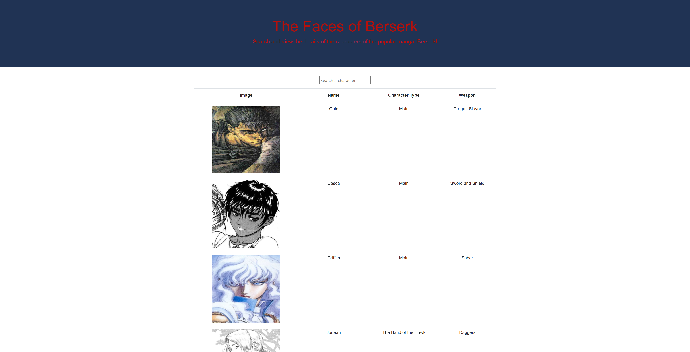

# Faces of Berserk
Directory application listing most of the characters from the popular manga and anime Berserk by Kentaro Miura.

## Description
This is a React based application which lists mosts of the major characters from the manga Berserk and details of their importance to the story and what weapons they use. Users can sort characters alphabetically (A-Z) by clicking on the name, type, and weapon of the character or search up a character by name. Currently the directory contains 27 characters.

## Table of Contents
* [Getting Started](#getting-started)
* [Installation](#installation)
* [Usage](#usage)
* [Author](#author)
* [Acknowledgments](#acknowledgments)
* [License](#license)

## Getting Started
* [Github Repository](https://github.com/nathanmvu/faces-of-berserk)
* [Deployed Link](https://nathanmvu.github.io/faces-of-berserk/)
* [Usage Demo Video](https://drive.google.com/file/d/1OxZkfHUEcwkTEx2aFPUWOSHM-1ofAbKB/view)


## Installation
To run the program, install it from the repository and then navigate to the App.js file in the src folder. In an integrated terminal run
`npm start`
and the program will launch in a web browser.

## Usage
Main Screen:


### Code Snippet
The code written to handle search inputs. Allows searching for characters by name and weapon.
```
  const handleInputChange = (search) => {
    const searchArray = [];
    for(let i = 0; i < Characters.length; i++) {
      if(Characters[i].name.includes(search) || 
      Characters[i].name.toLowerCase().includes(search) || 
      Characters[i].weapon.includes(search) ||
      Characters[i].weapon.toLowerCase().includes(search)){
        searchArray.push(Characters[i])
      }
    }
    setCharacters({
      type: 'search',
      input: searchArray
    });
  }

```

## Author
* Nathan Vu
* [Github](https://github.com/nathanmvu)
* [Email](mailto:nathanvu99@gmail.com)

## Acknowledgments
* Project parameters provided by the UCB Extension Coding Bootcamp

## License
[](https://github.com/tterb/atomic-design-ui/blob/master/LICENSEs)

